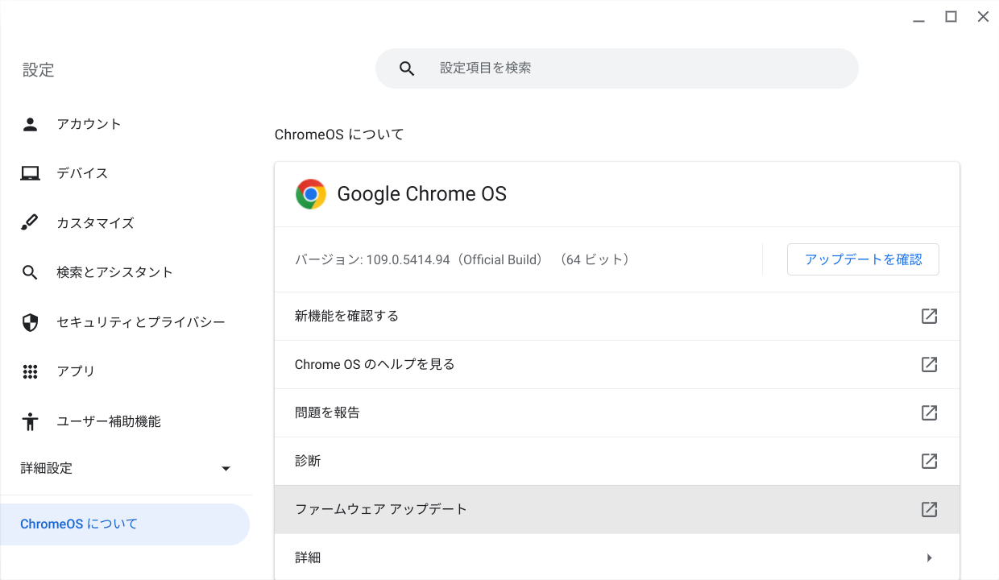

# 独学によるプログラミング演習

- [リポジトリ（Github）](https://github.com/Tatsukiyoshi/Weekend_Programming.git)
- [wiki](https://github.com/Tatsukiyoshi/Weekend_Programming/wiki)

##  共通
  - Visual Studio Code 1.74.3  
    エディタはVisual Studio Codeを中心に使っており、インストールしている拡張機能の一覧は、[VSCode拡張機能](_sub/vscodeExtensions.md)にまとめてあります。 
    - Chrome OS Flexではコマンドでアップデート
    
  - GitHub Desktop 3.1.3

## OS
  - Chrome OS Flex 109.0.5414.94
    

##  [Documentation](https://github.com/Tatsukiyoshi/Weekend_Programming/wiki/Documentation)

##  [Exercism](https://github.com/Tatsukiyoshi/Weekend_Programming/wiki/Exercism)

##  [Database & SQL](https://github.com/Tatsukiyoshi/Weekend_Programming/wiki/Database)

##  [Python](https://github.com/Tatsukiyoshi/Weekend_Programming/wiki/Python)

##  [Kotlin](https://github.com/Tatsukiyoshi/Weekend_Programming/wiki/Kotlin)

##  [TypeScript/JavaScript](https://github.com/Tatsukiyoshi/Weekend_Programming/wiki/TypeScript)

##  [Java](https://github.com/Tatsukiyoshi/Weekend_Programming/wiki/Java)

##  [.NET](https://github.com/Tatsukiyoshi/Weekend_Programming/wiki/.NET)

##  [Dart/flutter](https://github.com/Tatsukiyoshi/Weekend_Programming/wiki/Flutter)

##  [Rust](https://github.com/Tatsukiyoshi/Weekend_Programming/wiki/Rust)

##  [Go](https://github.com/Tatsukiyoshi/Weekend_Programming/wiki/Others#go)

##  [Pascal](https://github.com/Tatsukiyoshi/Weekend_Programming/wiki/Others#pascal)

##  [Swift](https://github.com/Tatsukiyoshi/Weekend_Programming/wiki/Others#swift)

##  [Unity](https://github.com/Tatsukiyoshi/Weekend_Programming/wiki/Unity)

##  [Ubuntu on Windows](https://github.com/Tatsukiyoshi/Weekend_Programming/wiki/Others)

### [Carbon](https://github.com/Tatsukiyoshi/Weekend_Programming/wiki/Others#carbon)

### [LLVM](https://github.com/Tatsukiyoshi/Weekend_Programming/wiki/Others#llvm)

## [痕跡](_sub/Profile.md)
