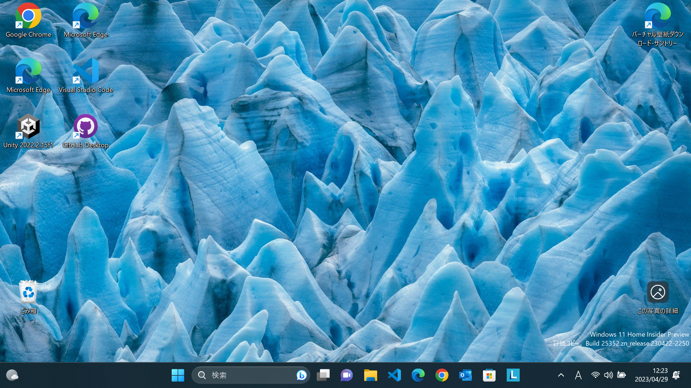
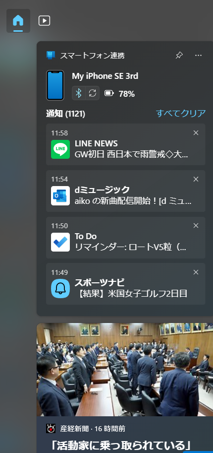
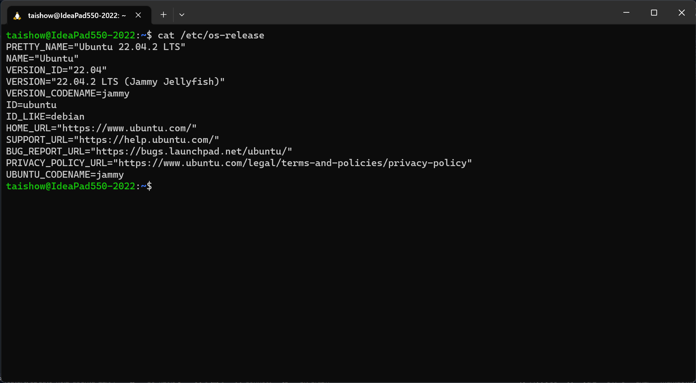
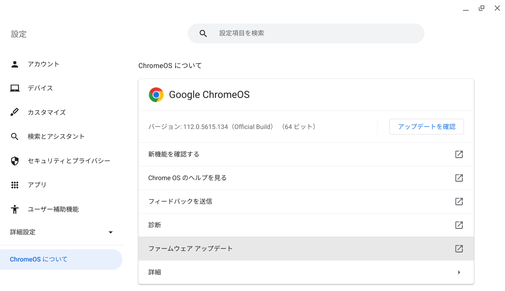
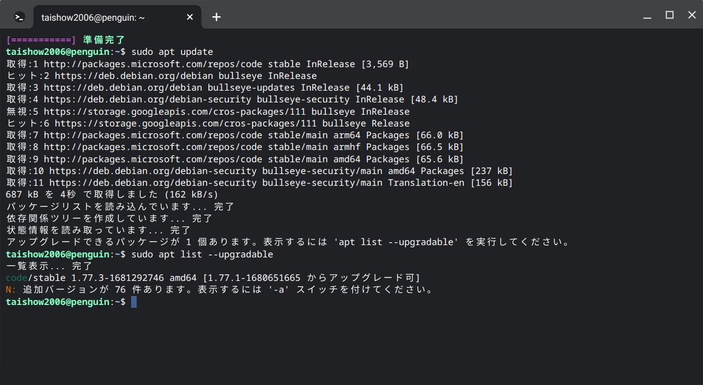

# 独学によるプログラミング演習
##  共通
### OS
  - [Windows Insider](https://blogs.windows.com/windows-insider/) Canary Channel
    - Build 25352
      
    - iPhoneとのスマートフォン連携が公開
      
    - [履歴](./windows/history.md)
  - [Ubuntu on Windows](https://github.com/Tatsukiyoshi/Weekend_Programming/wiki/Others) 22.04.2
    
    ```
    PRETTY_NAME="Ubuntu 22.04.2 LTS"
    NAME="Ubuntu"
    VERSION_ID="22.04"
    VERSION="22.04.2 LTS (Jammy Jellyfish)"
    VERSION_CODENAME=jammy
    ID=ubuntu
    ID_LIKE=debian
    HOME_URL="https://www.ubuntu.com/"
    SUPPORT_URL="https://help.ubuntu.com/"
    BUG_REPORT_URL="https://bugs.launchpad.net/ubuntu/"
    PRIVACY_POLICY_URL="https://www.ubuntu.com/legal/terms-and-policies/privacy-policy"
    UBUNTU_CODENAME=jammy
    ```
    - [【WSL2】Ubuntu 20.04.4 LTS を 22.04 LTS へアップグレードした](https://zenn.dev/ryuu/articles/upgrade-ubuntu2204-wsl)
  - [Chrome OS Flex](https://chromereleases.googleblog.com/search/label/ChromeOS%20Flex) 112.0.5615.134
    
  - [Oracle Cloud](https://github.com/Tatsukiyoshi/Weekend_Programming/wiki/OracleCloud)
### ツール  
  - [Visual Studio Code 1.77.3](https://code.visualstudio.com/) <BR />
    エディタはVisual Studio Codeを中心に使っており、インストールしている拡張機能の一覧は、[VSCode拡張機能](_sub/vscodeExtensions.md)にまとめてあります。<BR />
    - Chrome OS Flexではコマンドでアップデート
    
  - [Git 2.40.1](https://git-scm.com/download)
    - Windowsでの更新
      ```
      git update-git-for-windows
      ```
  - [GitHub Desktop 3.2.3](https://desktop.github.com/release-notes/)
---
##  [Database & SQL](https://github.com/Tatsukiyoshi/Weekend_Programming/wiki/Database)
##  [.NET](https://github.com/Tatsukiyoshi/Weekend_Programming/wiki/.NET)
##  [Rust](https://github.com/Tatsukiyoshi/Weekend_Programming/wiki/Rust)
##  [Kotlin](https://github.com/Tatsukiyoshi/Weekend_Programming/wiki/Kotlin)
##  [Java](https://github.com/Tatsukiyoshi/Weekend_Programming/wiki/Java)
##  [Dart/flutter](https://github.com/Tatsukiyoshi/Weekend_Programming/wiki/Flutter)
##  [TypeScript/JavaScript](https://github.com/Tatsukiyoshi/Weekend_Programming/wiki/TypeScript)
##  [Go](https://github.com/Tatsukiyoshi/Weekend_Programming/wiki/Go)
##  [Python](https://github.com/Tatsukiyoshi/Weekend_Programming/wiki/Python)
##  [Pascal](https://github.com/Tatsukiyoshi/Weekend_Programming/wiki/Others#pascal)
##  [Swift](https://github.com/Tatsukiyoshi/Weekend_Programming/wiki/Others#swift)
##  [Carbon](https://github.com/Tatsukiyoshi/Weekend_Programming/wiki/Carbon)
##  [LLVM](https://github.com/Tatsukiyoshi/Weekend_Programming/wiki/Others#llvm)
---
##  [Documentation](https://github.com/Tatsukiyoshi/Weekend_Programming/wiki/Documentation)
##  [Unity](https://github.com/Tatsukiyoshi/Weekend_Programming/wiki/Unity)
##  [Exercism](https://github.com/Tatsukiyoshi/Weekend_Programming/wiki/Exercism)
---
##  [痕跡](_sub/Profile.md)
