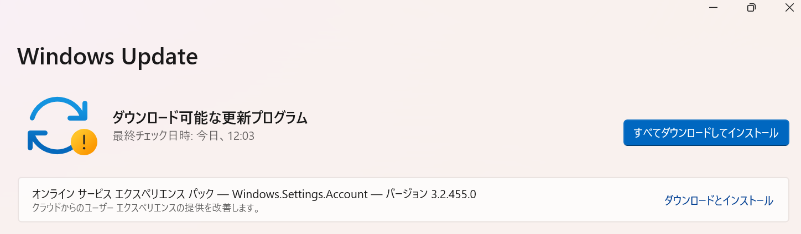
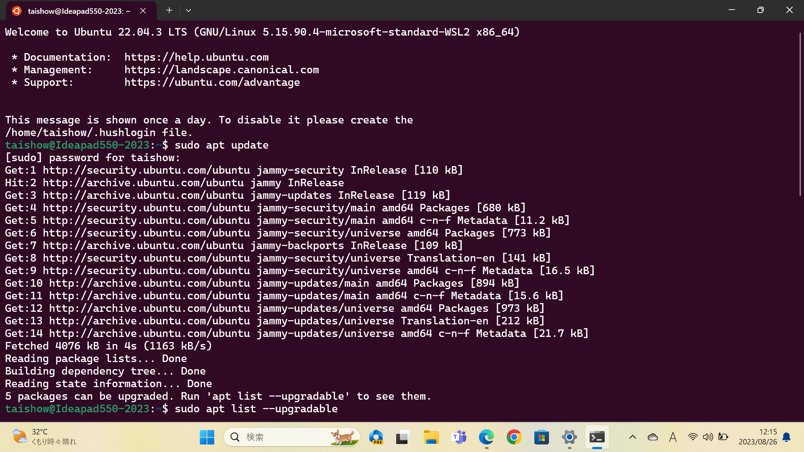
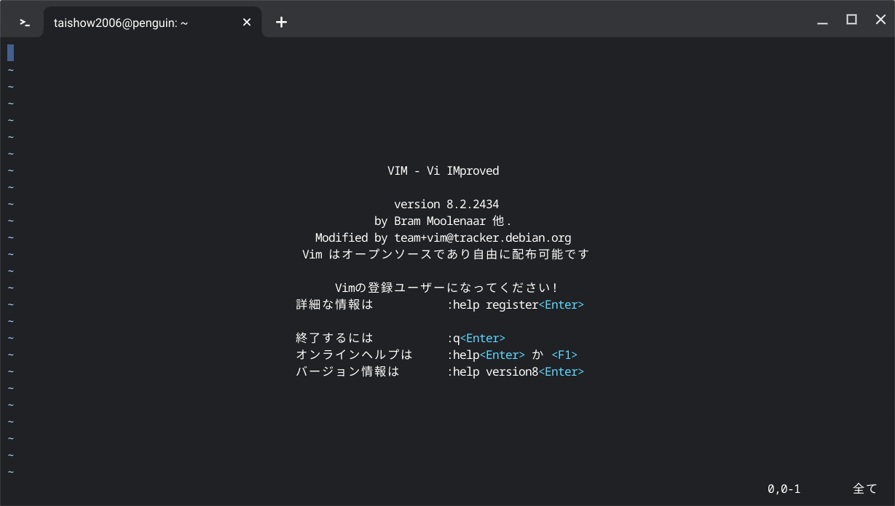
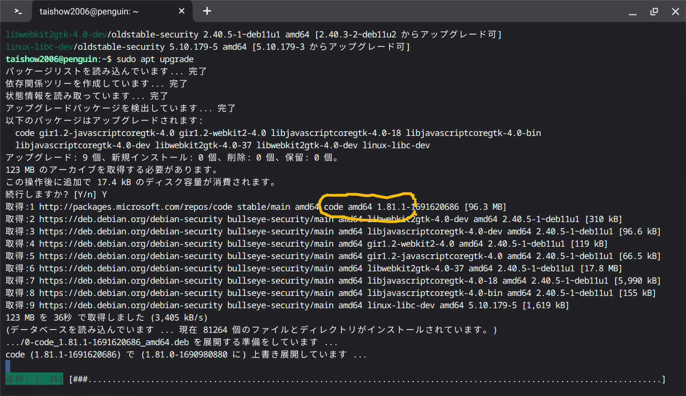

# 独学プログラミング演習
##  共通
### OS
  - [Windows Insider](https://blogs.windows.com/windows-insider/)
    - Dev Channel
      - Build 23531 <span style="color: red;">*<<2023/08/26 updated from 23526>>*</span>
        
        - Build 23531適用前に表示されたオンラインサービスエクスペリエンスパックって何？
          
    - [履歴](./windows/history.md)
    - [USBメモリの復旧](https://jp.easeus.com/partition-manager/fix-usb-drive-incorrect-size.html)
    - [Dev Channelへの変更](https://mitomoha.hatenablog.com/entry/2023/08/11/010623)
  - [WSL2](https://learn.microsoft.com/ja-jp/windows/wsl/install)
    - [Ubuntu 22.04.3](https://www.releases.ubuntu.com/jammy/)
      
    - [履歴](./wsl/history.md)
    - ディストリビューションのバージョンを確認する
      ```
      lsb_release -a
      ```
    - [【WSL2】Ubuntu 20.04.4 LTS を 22.04 LTS へアップグレードした](https://zenn.dev/ryuu/articles/upgrade-ubuntu2204-wsl)
  - [Chrome OS Flex](https://chromereleases.googleblog.com/search/label/ChromeOS%20Flex)
    - 116.0.5845.120 <span style="color: red;">*<<2023/8/26 updated from 115.0.5790.182>>*</span>
      
      - メニューからVimを起動できるようになった
        
    - [履歴](./chrome/history.md)
  - [Oracle Cloud](https://github.com/Tatsukiyoshi/Weekend_Programming/wiki/OracleCloud)
### ツール  
  - [Visual Studio Code 1.81.1](https://code.visualstudio.com/) <span style="color: red;">*<<2023/8/11 updated from 1.81>>*</span> <BR />
    エディタはVisual Studio Codeを中心に使っており、インストールしている拡張機能の一覧は、[VSCode拡張機能](_sub/vscodeExtensions.md)にまとめてあります。<BR />
    - Chrome OS Flexではコマンドでアップデート
    
  - [Git 2.41](https://git-scm.com/download) <span style="color: red;">*<<2023/6/11 updated from 2.40.1>>*</span>
    - Windowsでの更新
      ```
      git update-git-for-windows
      ```
  - [GitHub Desktop 3.2.7](https://desktop.github.com/release-notes/) <span style="color: red;">*<<2023/8/1 updated from 3.2.6>>*</span>
    サイトでのリリース通知があってから、アップデートできるまでにはタイムラグがありそう
---
##  [Database & SQL](https://github.com/Tatsukiyoshi/Weekend_Programming/wiki/Database)
##  [.NET](https://github.com/Tatsukiyoshi/Weekend_Programming/wiki/.NET)
##  [Rust](https://github.com/Tatsukiyoshi/Weekend_Programming/wiki/Rust)
##  [Kotlin](https://github.com/Tatsukiyoshi/Weekend_Programming/wiki/Kotlin)
##  [Java](https://github.com/Tatsukiyoshi/Weekend_Programming/wiki/Java)
##  [Dart/flutter](https://github.com/Tatsukiyoshi/Weekend_Programming/wiki/Flutter)
##  [TypeScript/JavaScript](https://github.com/Tatsukiyoshi/Weekend_Programming/wiki/TypeScript)
##  [Go](https://github.com/Tatsukiyoshi/Weekend_Programming/wiki/Go)
##  [Python](https://github.com/Tatsukiyoshi/Weekend_Programming/wiki/Python)
##  [Pascal](https://github.com/Tatsukiyoshi/Weekend_Programming/wiki/Others#pascal)
##  [Swift](https://github.com/Tatsukiyoshi/Weekend_Programming/wiki/Others#swift)
##  [Carbon](https://github.com/Tatsukiyoshi/Weekend_Programming/wiki/Carbon)
##  [LLVM](https://github.com/Tatsukiyoshi/Weekend_Programming/wiki/Others#llvm)
---
##  [Documentation](https://github.com/Tatsukiyoshi/Weekend_Programming/wiki/Documentation)
##  [Unity](https://github.com/Tatsukiyoshi/Weekend_Programming/wiki/Unity)
##  [Exercism](https://github.com/Tatsukiyoshi/Weekend_Programming/wiki/Exercism)
---
##  [痕跡](_sub/Profile.md)
