# 表示画面フラグを持つリスト

|表示画面フラグ|シーケンスNo|場所|状態|
|---|---|---|---|
|1|1|xyz|1|
|1|2|abc|1|
|1|3|xyz|0|
|2|4|def|1|
|3|5|ghi|1|

---
# 表示画面の振り分け
<!-- draw.ioで作成した図をエクスポートして挿入する -->

---
# リストに基づく表示画面

## 画面1a・・・表示画面フラグ=1を全部表示
|場所|状態|
|---|---|
|xyz|1|
|abc|1|
|xyz|0|

---
## 画面1b・・・表示画面フラグ=1/状態=1しか持たない
|場所|状態|
|---|---|
|abc|1|

---
## 画面2a・・・表示画面フラグ=2を全部表示
|場所|状態|
|---|---|
|def|1|

---
## 画面2b・・・表示画面フラグ=2/状態=1しか持たない
|場所|状態|
|---|---|

---
## 画面3a・・・表示画面フラグ=3を全部表示
|場所|状態|
|---|---|
|ghi|1|

---
## 画面3b・・・表示画面フラグ=3/状態=1しか持たない
|場所|状態|
|---|---|

