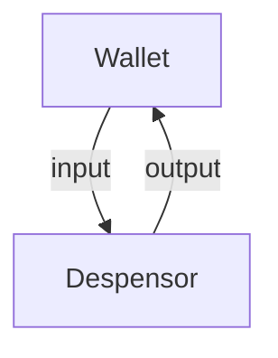

# テキストベースでの仕様書作成

## 骨格は、Markdown形式でまとめる
## 仕様書を構成する要素は、それぞれに合った形式で取り込む

## DFDは、mermaid形式／dot形式でまとめる
  * mermaid形式でまとめる場合

  ```
    ```mermaid
    graph TD
        Wallet -- input --> Despensor
        Despensor -- output --> Wallet
    ```
  ```



  * dot形式でまとめる

## ステートチャートをはじめとするUMLは、PlantUMLでまとめる

  ```
    ```PlantUML
    @startUML
      state Member {
        unregisterd --> previsional : requested
        previsional --> official : approved
      }
    @endUML
    ```
  ```

```PlantUML
@startUML
    state Member {
      unregisterd --> previsional : requested
      previsional --> official : approved
    }
@endUML
```

## RESTful-API仕様書は、swagger形式でまとめる

swaggerについては、以下に示す。

---
@import "swagger\readme.md"
---
