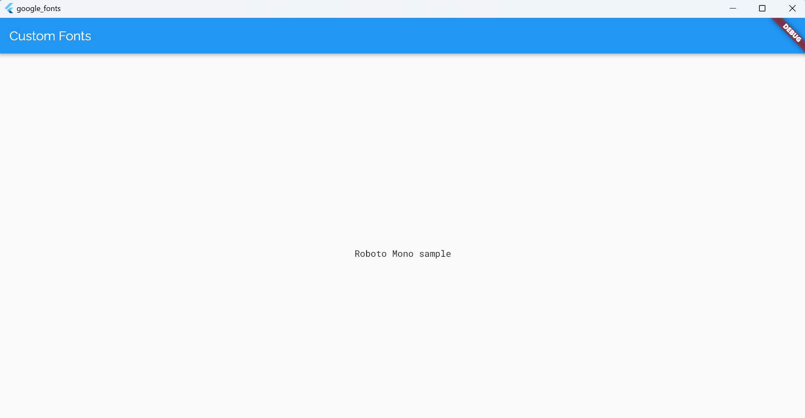
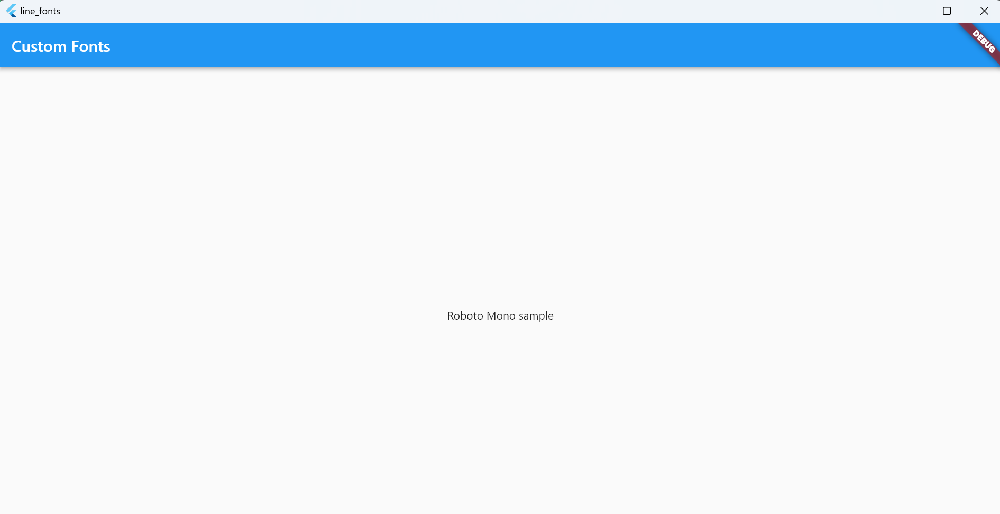

*   flutterの更新
    ```
    flutter upgrade
    ```
*   カスタムフォントの利用
    [公式ドキュメント](https://docs.flutter.dev/cookbook/design/fonts)
    *   Raleway and Roboto Mono(Google Fonts)
        
    *   LINESeed JP
        
