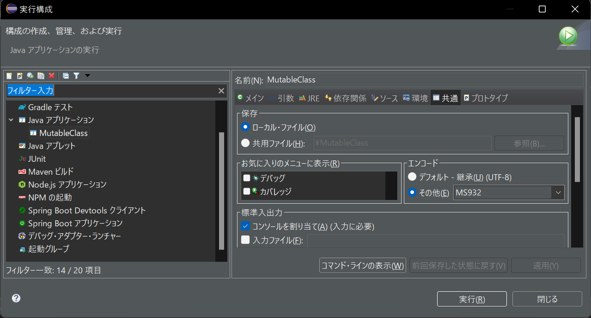

*   Pleiades 2022-06およびTomcat 10.0.20での対応
    -   サーブレット等の作成は、[新規]-[その他]から行う。
    -   その他サーブレットやJSPについては、[別ドキュメント](servlet_jsp.md)参照。 

* バージョン移行
    1.  新しいバージョンをダウンロードする
    1.  旧バージョンのフォルダを削除する
    1.  ダウンロードしたファイルを展開する
        *   Windowsでは、ZIPファイルの名前ではなく、短い名前のフォルダ配下に展開する。
    1.  eclipseを起動する。
    1.  以前使用していたワークスペースを選択した場合、「古いバージョンで作成されました。続行して、古いバージョンと互換性がない可能性があるワークスペースを更新しますか？」と確認されるので、「続行」を選択して継続する。
    1.  「-clean開始中」と出ているので待つ。
    1.  ワークスペースが表示される。

*   エンコード設定
    -   日本語を入出力する際、実行構成の設定を行う。
        
        -   共通タブのエンコードにて、その他を選択し、ドロップダウンリストから"MS932"を選択する。
