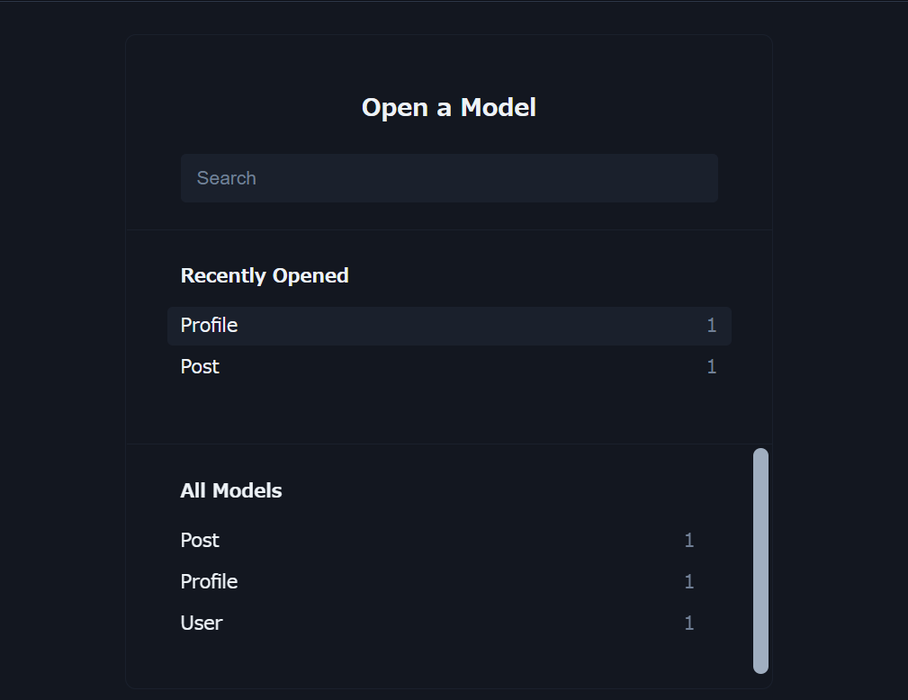
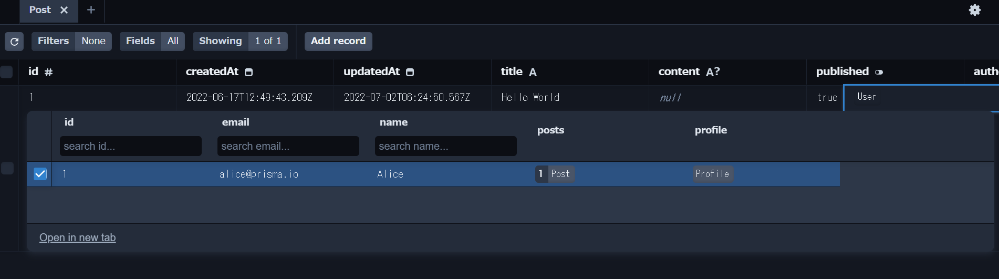

*   Prisma Studio
    Prismaを使うプロジェクト配下でデータベースを参照することができるWebアプリケーション
    *   起動
        ```
        npx prisma studio
        ```
        プロジェクトのディレクトリで上記コマンドを実行すると、Webブラウザが起動される。
        接続するデータベースは、.envの設定を使って接続し、
        テーブルは、schema.prismaを参照しているらしい。
        ```
        Environment variables loaded from .env
        Prisma schema loaded from prisma\schema.prisma
        Prisma Studio is up on http://localhost:5555
        ```
    *   トップ画面
        
    *   テーブルビュー
        
