- Windows Insider History
  - Canary Channel
    - Build 25336
      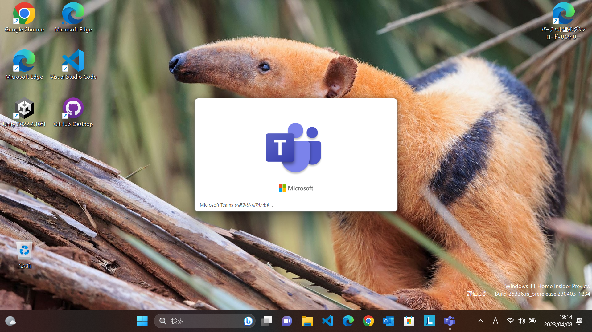
    - Build 25330
      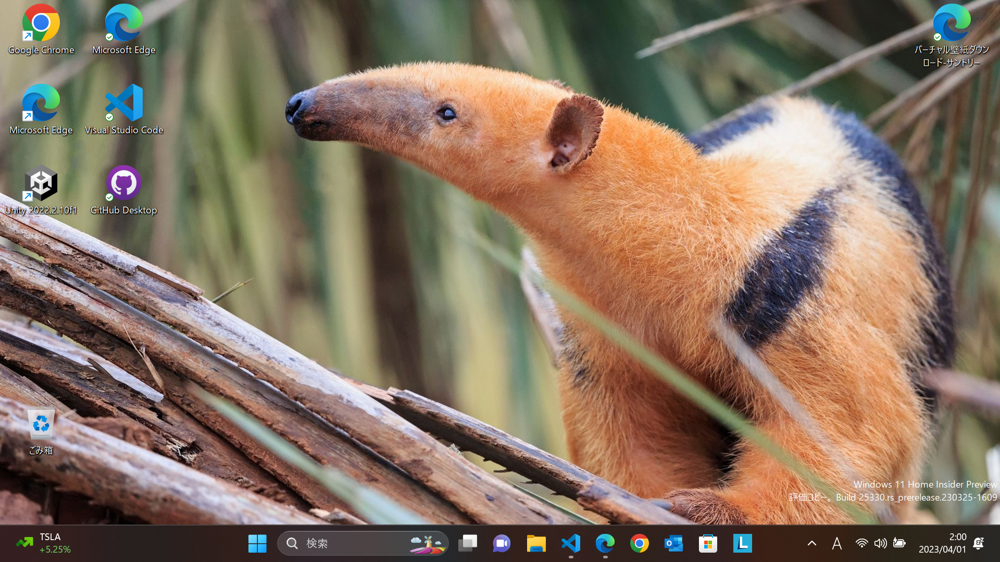
    - Build 25324
      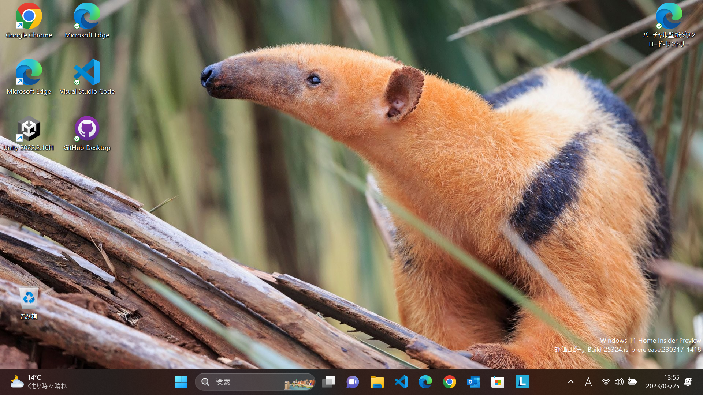
    - Build 25314
      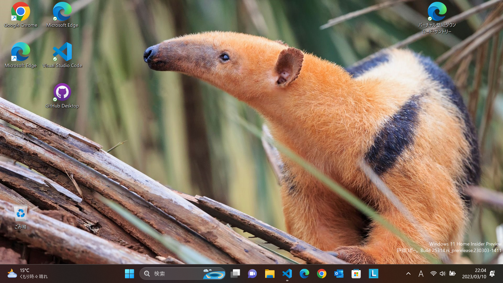
  - Dev Channel
    - Build 25309
      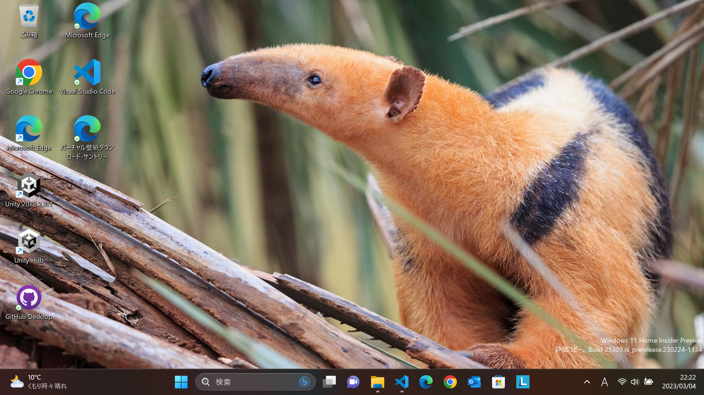
      - 音量ミキサーが新しくなった（Windows＋CTRL＋Vというショートカットも）
        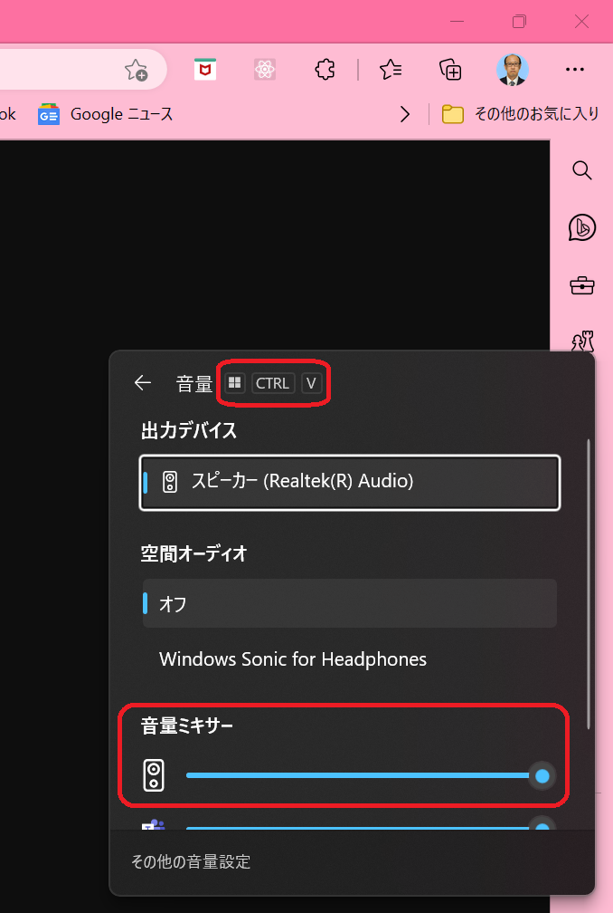
      - アプリの色を自動的に管理
        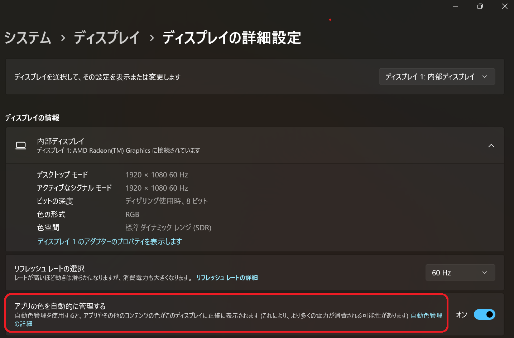
      - iPhoneとリンクできるようになる（予告）
        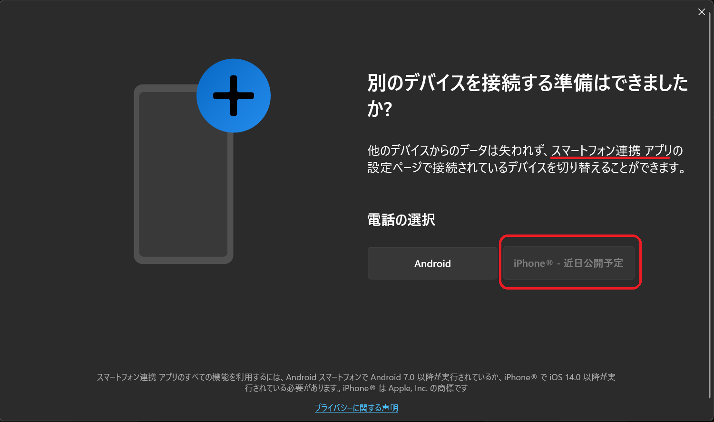
    - Build 25300
      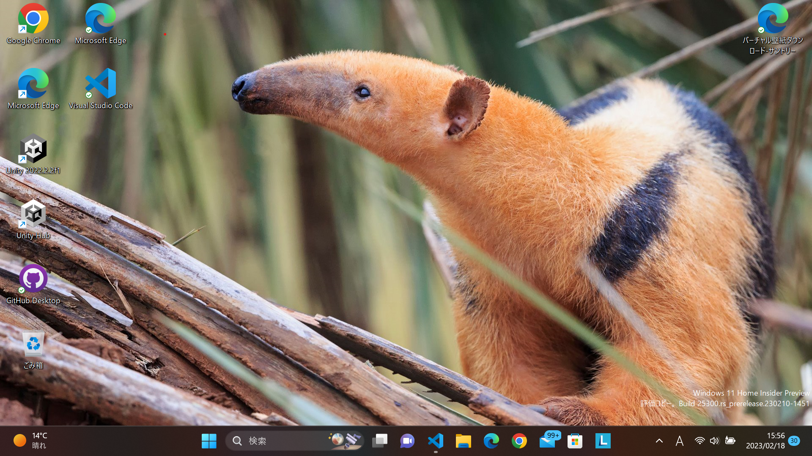
    - Build 25295
      
      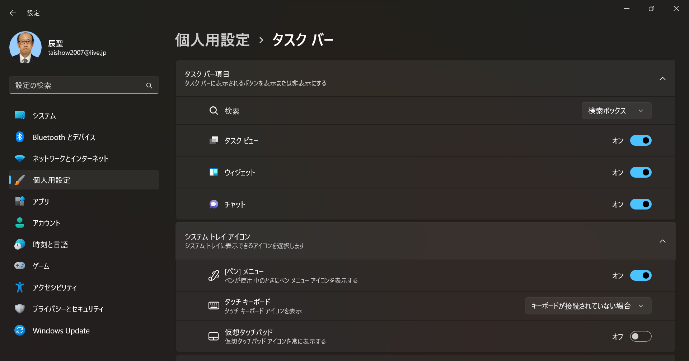
    - Build 25290
      
      - ウイジェットにSportifyやPhoneLinkが追加
      
    - Build 25284
      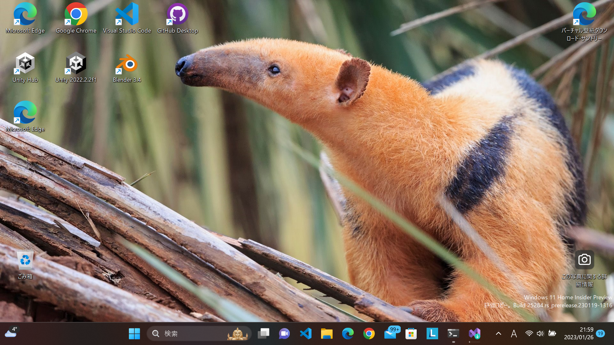
    - Build 25281
      - 背景にWindowsスポットライトを設定してみた！
      - メモ帳にタブがついた！
      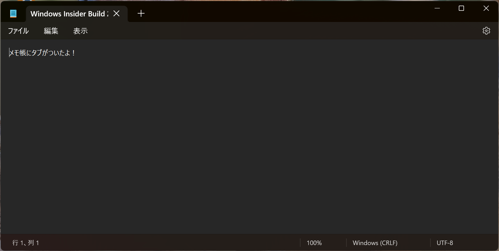
