- Windows Insider History
  - Canary Channel
    - Build 25926 *<<2023/08/11 updated from 25921>>*
      
    - Build 25921 *<<2023/08/06 updated from 25915>>*
      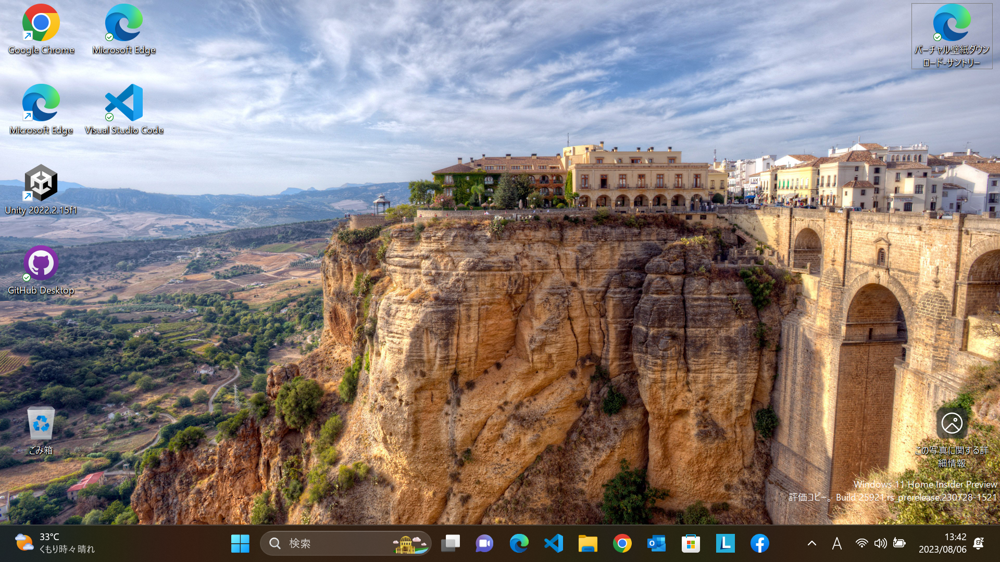
    - Build 25915 *<<2023/7/28 updated from 25905>>*
      
      - WSLが起動できない問題解消
        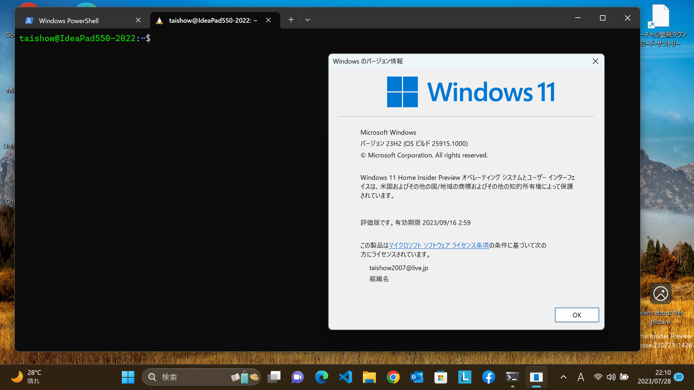
    - Build 25905 *<<2023/7/13 updated from 25393>>*
      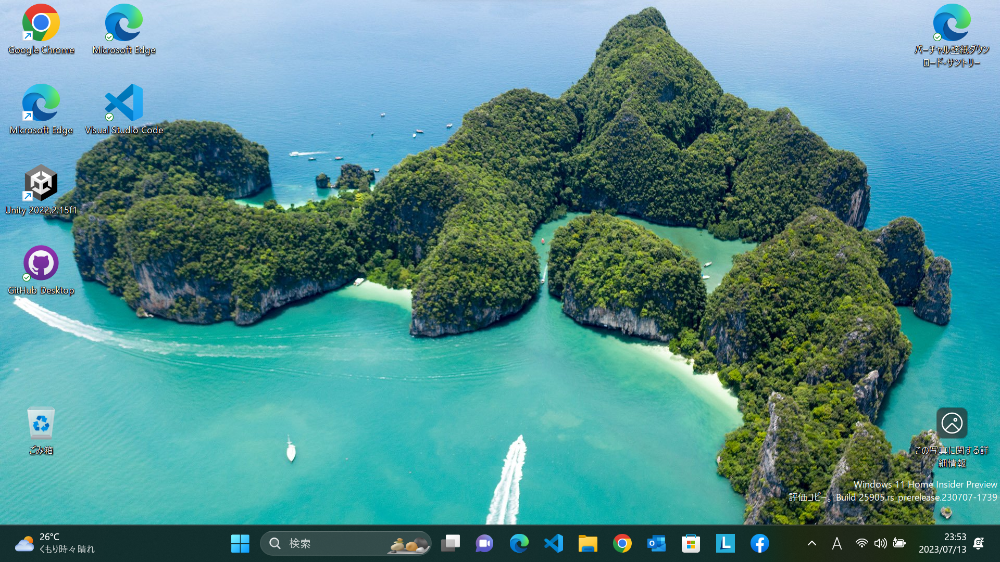
      - WSL起動できない問題発生
      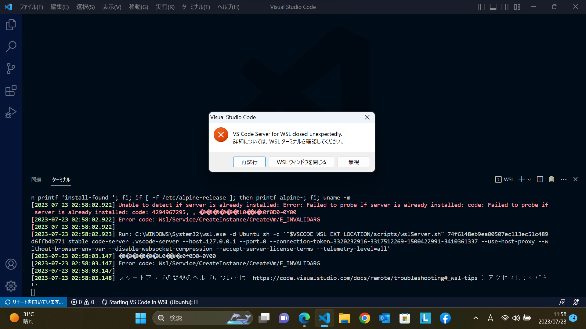
      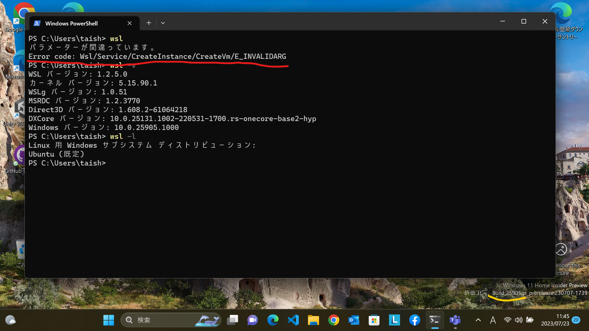
    - Build 25393 *<<2023/6/17 updated from 25389>>*
      
    - Build 25387 *<<2023/6/11 updated from 25375>>*
      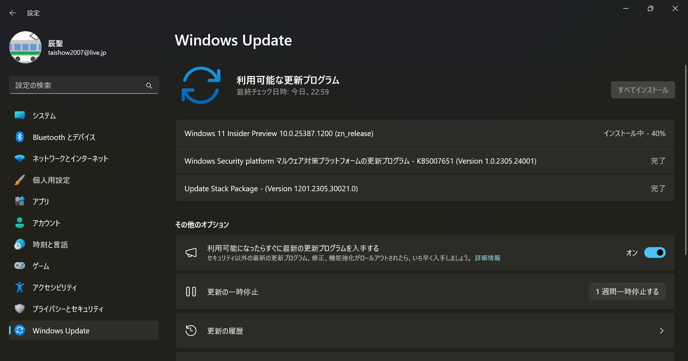
      - 更新直後は、背景画像が初期状態になったので、再度スポットライトを選択。
        
    - Build 25375
      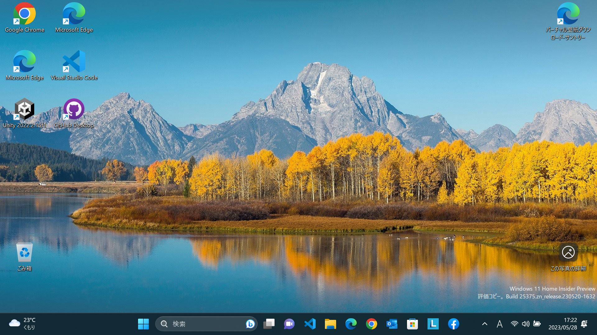
      - Facebookのウィジェットが追加できた！
      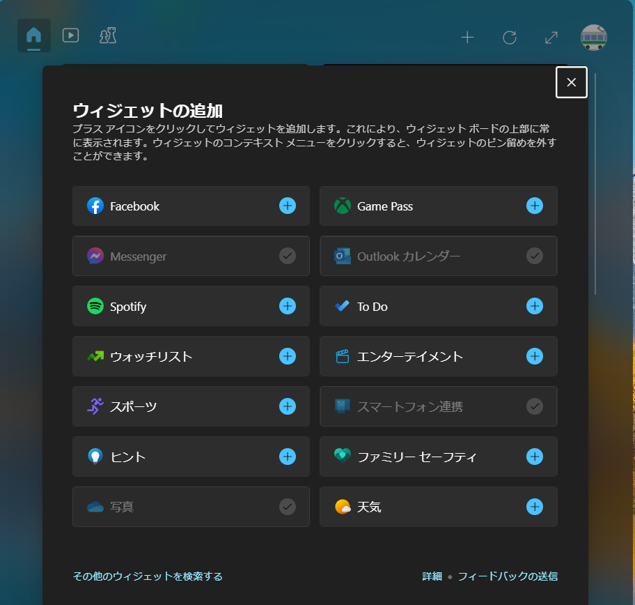
    - Build 25370
      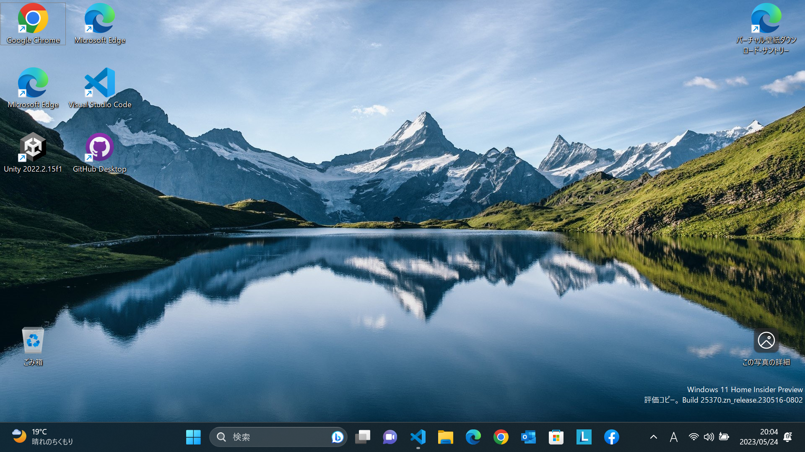
    - Build 25357
      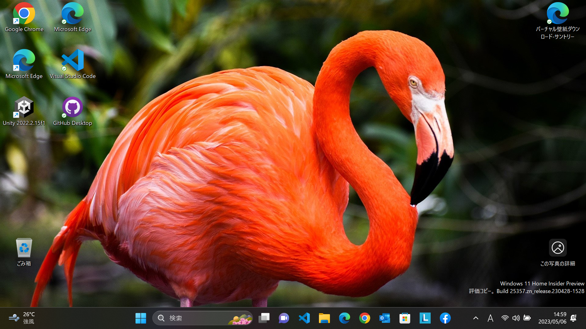
    - FacebookMessengerのウィジェットがプレビュー公開
      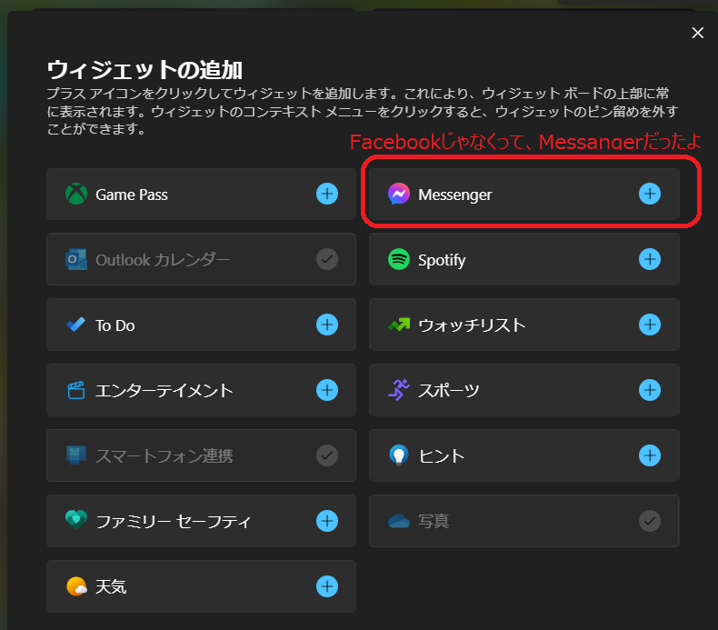
    - Build 25352
      
    - iPhoneとのスマートフォン連携が公開
      
    - Build 25346
      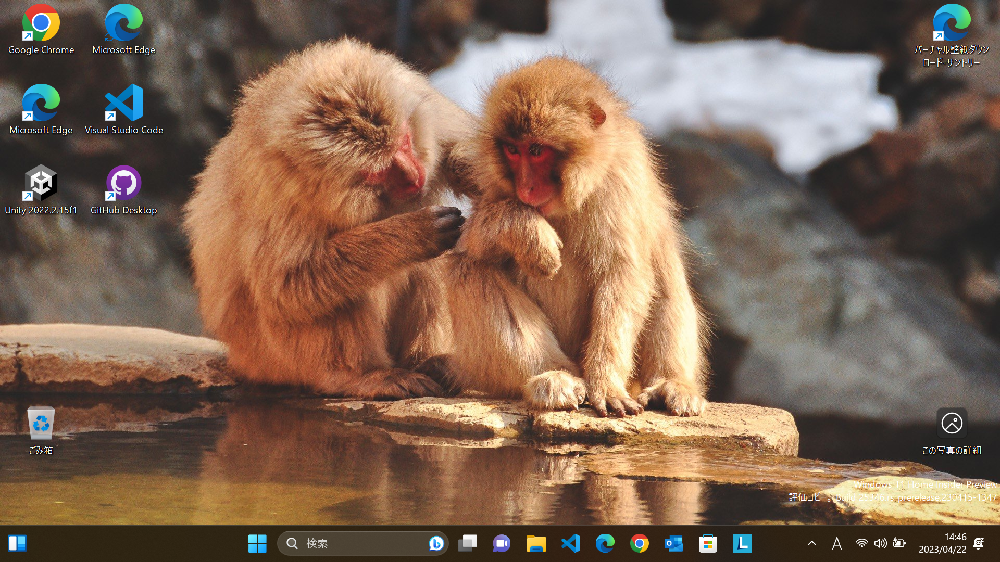
    - Build 25336
      
    - Build 25330
      
    - Build 25324
      
    - Build 25314
      
  - Dev Channel
    - Build 25309
      
      - 音量ミキサーが新しくなった（Windows＋CTRL＋Vというショートカットも）
        
      - アプリの色を自動的に管理
        
      - iPhoneとリンクできるようになる（予告）
        
    - Build 25300
      
    - Build 25295
      
      
    - Build 25290
      
      - ウイジェットにSportifyやPhoneLinkが追加
      
    - Build 25284
      
    - Build 25281
      - 背景にWindowsスポットライトを設定してみた！
      - メモ帳にタブがついた！
      
